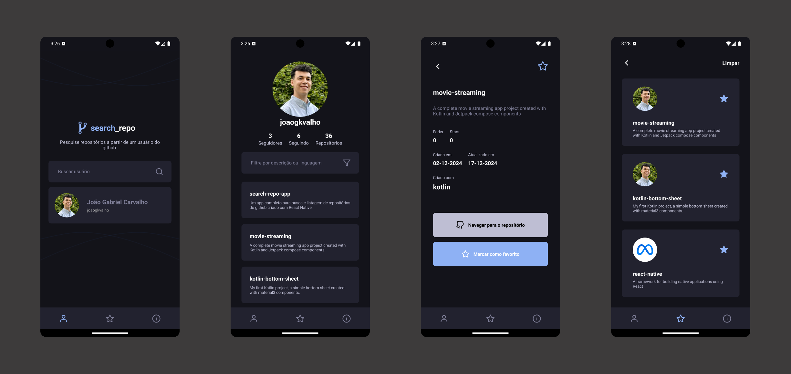

<h1 align="center" style="font-weight: bold;">🔗 search_repo</h1>

<p align="center">
 <a href="#tech">Tecnologias</a> • 
 <a href="#started">Rodando o projeto</a>
</p>

<p align="center">
    <b>Um app completo para busca e listagem de repositórios do Github</b>
</p>

<h2 id="layout">🎨 Layout</h2>

<p align="center">
    
</p>

<h2 id="tech">💻 Tecnologias</h2>

- React Native
- Redux Toolkit
- React Navigation
- Async Storage
- StyleSheet

<h2 id="about">✨ Neste projeto você pode ver</h2>

- Pesquisa e listagem de usuário do github
- Listagem de repositórios do usuário pesquisado
- Tela de informações detalhadas dos repositórios
- Função para marcar/desmarcar repositório como favorito
- Listagem de repositórios favoritos

<h2 id="started">🚀 Rodando o projeto</h2>

Para rodar este projeto você irá precisar

- Node
- Git
- Expo
- Android Studio
- npm (Já vem instalado juntamente com o Node)

<h3>Clonando</h3>

Como clonar o projeto:

```bash
git clone https://github.com/joaogkvalho/search-repo-app.git
```

<h3>Rodando</h3>

Como iniciar o projeto:

- Entrando no diretório do projeto

```bash
cd search-repo-app
```

- Instalando as depedências

```bash
npm install
```

- Rodando o projeto

```bash
npx expo start
```
